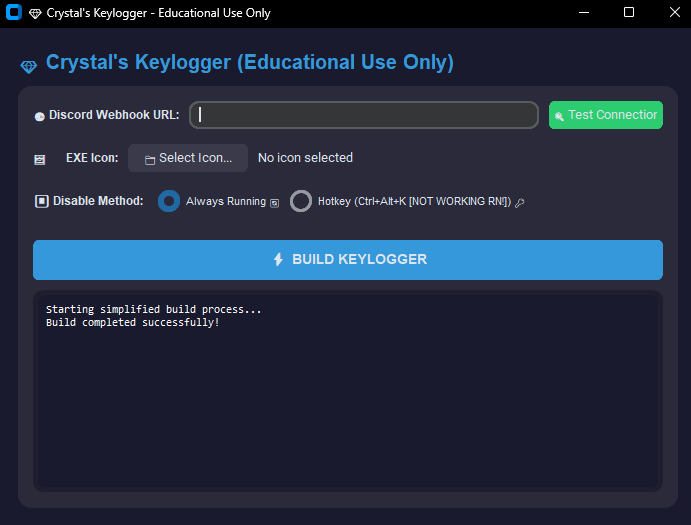
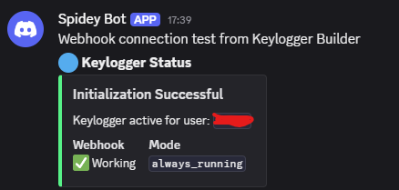
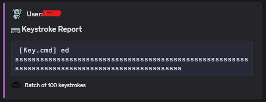

# Keylogger Builder

⚠️ **Warning**: This project is for educational purposes only. Use responsibly and only on systems you own or have permission to monitor.

## Screenshots

### Builder UI

### Discord Webhook Examples

## Features
- Modern CustomTkinter UI
- Discord webhook integration
- Stealth operation mode
- Automatic dependency installation
- EXE builder with icon support

## Requirements
- Python 3.8+
- See requirements.txt

## Usage
1. Install dependencies: `pip install -r requirements.txt`
2. Run builder: `python builder.py`
3. Configure options and build

## Legal Notice
The creator is not responsible for any misuse of this software. Use at your own risk.
